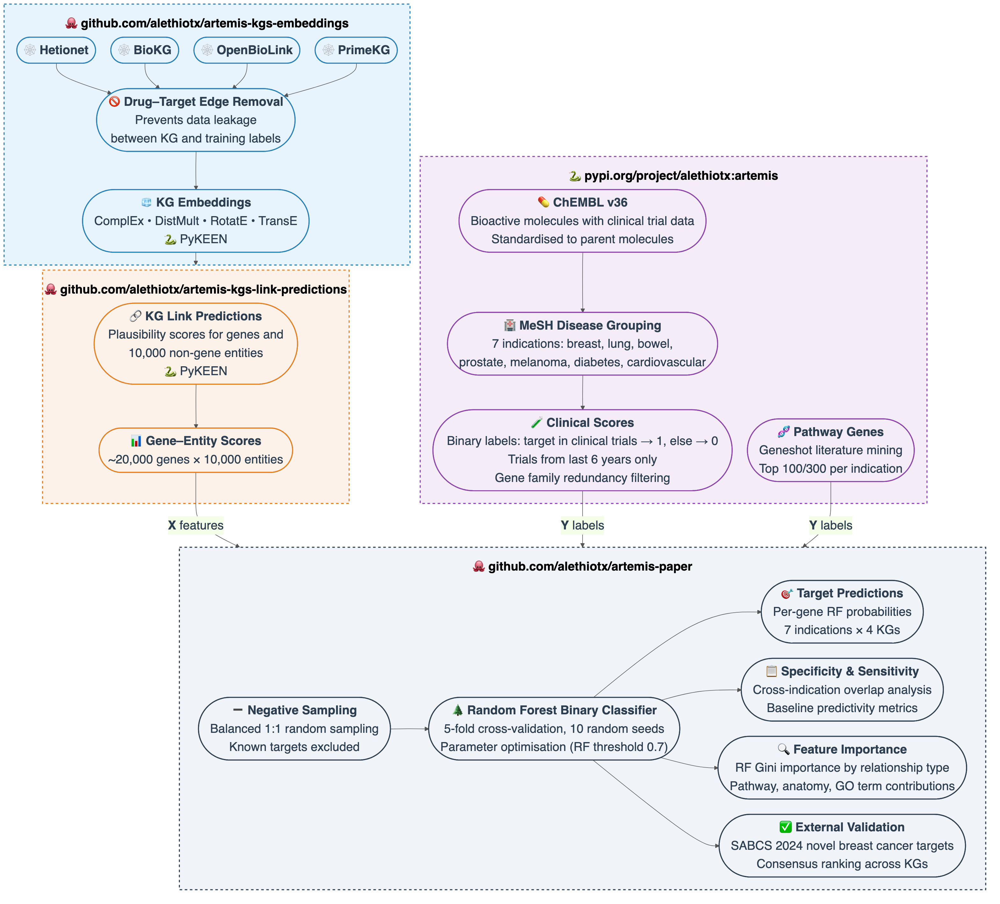

- 
- 
- 

# Artemis Pipeline

**Artemis**: Indication-Aware Target Prioritization by Integrating Public Knowledge Graphs with Clinical Data

A Nextflow pipeline to reproduce the results from the Artemis paper.

---

## Pipeline Overview



*Figure 1: End-to-end architecture spanning KG embedding generation (artemis-kgs-embeddings), link prediction scoring (artemis-kgs-link-predictions), clinical label construction (alethiotx), and the paper pipeline itself—from negative sampling through Random Forest classification to target predictions, feature importance, and external validation.*



*Figure 2: Nextflow process DAG showing data ingestion, knowledge graph analysis, model training, target prediction, and visualization steps.*

---

## Overview

This pipeline performs:
- **Data ingestion**: ChEMBL drugs, MeSH disease terms, clinical scores from trials
- **Knowledge graph analysis**: Feature extraction from Hetionet, BioKG, OpenBioLink, and PrimeKG using 4 embedding methods (ComplEx, DistMult, RotatE, TransE). KG data is stored in `s3://alethiotx-artemis/data/kgs-no-data-leakage/`
- **Cross-validation**: Binary, multiclass, and regression models for 7 disease indications across all KG × embedding combinations
- **Target prediction**: Random forest classifiers trained on KG embeddings (RotatE) + clinical scores
- **Consensus analysis**: Averaging predictions across knowledge graphs and iterations with hierarchical clustering
- **Robustness analyses**: Negative sampling sensitivity analysis and confident negative selection experiments
- **Feature importance**: Gini importance extraction by entity/relationship type across KG × embedding × indication
- **Visualization**: Upset plots, heatmaps, ROC curves, baseline statistics, and consensus clustermaps

---

## Quick Start

### Prerequisites
- [Nextflow](https://www.nextflow.io/) ≥ 23.04
- Docker or Singularity

### Installation

```bash
# Pipeline runs with pre-built Docker image (public.ecr.aws/alethiotx/artemis-paper:latest)
nextflow run main.nf -profile local
```

### Run the pipeline
```bash
# Default mode: predictions
nextflow run main.nf -profile local

# Specify a different mode
nextflow run main.nf -profile local --mode cv

# Use specific scores date
nextflow run main.nf -profile local --scores_date 2025-12-12
```

---

## Pipeline Modes

Controlled via `--mode` parameter:

### 1. `data`
Download and preprocess external datasets:
- ChEMBL drug database
- MeSH disease ontology

**Usage:**
```bash
nextflow run main.nf --mode data
```

### 2. `scores`
Compute clinical target scores and pathway gene sets for 7 indications:
- Breast, Lung, Bowel, Prostate, Melanoma, Diabetes, Cardiovascular

**Usage:**
```bash
nextflow run main.nf --mode scores --scores_date 2025-12-12
```

### 3. `cv` (Cross-Validation)
Evaluate ML models (Random Forest) across:
- 4 knowledge graphs
- 4 embedding methods (ComplEx, DistMult, RotatE, TransE)
- 7 disease indications  
- 3 task types: binary, multiclass, regression

**Outputs:**
- ROC-AUC and average precision scores per KG/embedding/indication/task
- Raw embedding feature evaluation
- Learning curves (subsampling analysis across embeddings)

**Usage:**
```bash
nextflow run main.nf --mode cv
```

### 4. `predictions` (default)
Train classifiers and predict targets:
- Grid search: 4 KGs × RotatE embedding × 3 filtering modes × 5 RF thresholds × 3 pathway gene counts × 10 iterations
- Outputs: predicted targets, training sets, cross-indication overlap matrices, SABCS validation, baseline statistics
- Aggregates all predictions and training labels into unified pickle files for downstream analysis
- **Baseline Analysis:**
  - Computes baseline statistics (percentage of targets above threshold) averaged across iterations and KGs
  - Generates per-indication heatmaps showing baseline percentages by clinical trial filter, RF threshold, and pathway genes
  - Creates comprehensive boxplot comparing baseline distributions across all 7 indications
  - Produces publication-ready comparison plot faceting baseline, sensitivity, and specificity (plotnine/ggplot2 style)
- **SABCS Consensus:**
  - Generates standard heatmap grids for each RF threshold (pathway genes × clinical trial filters × KGs)
  - Creates horizontal heatmap for RF 0.7 with Unique CT filter across all 4 KGs for focused comparison
  - Performs hierarchical clustering to identify consensus predictions across knowledge graphs

**Usage:**
```bash
nextflow run main.nf --mode predictions --scores_date 2025-12-12
```

### 5. `post_predictions`
Recompute baseline statistics and consensus analysis using existing prediction results:
- Loads pre-computed target predictions and training sets from S3
- Regenerates baseline statistics and visualizations across all indications
- Recomputes SABCS consensus predictions without retraining models
- Updates visualization styles (e.g., plotnine-based plots with enhanced aesthetics)
- Useful for updating visualizations or analysis parameters without re-running expensive compute jobs

**Usage:**
```bash
nextflow run main.nf --mode post_predictions
```

### 6. `kgs`
Generate knowledge graph overview notebook (statistics, entity counts, relationship types).

**Usage:**
```bash
nextflow run main.nf --mode kgs
```

### 7. `upset`
Create UpSet plots showing target overlap across knowledge graphs and filtering strategies.

**Usage:**
```bash
nextflow run main.nf --mode upset
```

### 8. `negative_sampling`
Robustness analyses for the negative sampling strategy, addressing reviewer concerns about unlabeled genes being treated as negatives.

**Analyses:**
- **Sensitivity analysis**: Measures AUROC variance, per-gene prediction stability, and pairwise Jaccard similarity of predicted target sets across the 10 training iterations (each using different random negatives). Runs across all KG × embedding × CT filter × pathway gene combinations.
- **Confident negative selection**: Two-step experiment where an initial RF model scores all unlabeled genes, then only genes with low predicted probability (bottom 25th percentile) are retained as "reliable" negatives for retraining. Compares AUROC and target overlap against the standard approach across the full parameter grid.

**Prerequisites:** Clinical scores and pathway genes must already exist on S3 (run `--mode scores` first if needed).

**Usage:**
```bash
nextflow run main.nf --mode negative_sampling
```

**Outputs:**
```
s3://alethiotx-artemis/figs_review/
├── sensitivity_analysis/
│   ├── data/
│   │   ├── auroc_variance.csv         # AUROC mean ± SD per KG/embedding/indication
│   │   ├── gene_stability.csv         # Per-gene prediction frequency summary
│   │   └── jaccard_similarity.csv     # Pairwise Jaccard between iteration target sets
│   └── plots/
│       ├── auroc_variance.png         # AUROC variance across iterations
│       ├── gene_stability.png         # Distribution of gene prediction stability
│       └── jaccard_*.png              # Pairwise Jaccard heatmaps per indication/KG
└── confident_negatives/
    ├── data/
    │   ├── confident_neg_auroc.csv    # AUROC comparison (standard vs confident)
    │   └── confident_neg_overlap.csv  # Target set overlap between approaches
    └── plots/
        ├── auroc_comparison.png       # Side-by-side AUROC bars
        └── overlap_comparison.png     # Jaccard overlap heatmap
```

### 9. `feature_importance`
Extract and visualize Gini feature importances from Random Forest classifiers, aggregated by entity/relationship type (e.g., Gene, Biological Process, Pathway, Disease).

- Trains classifiers for each KG × embedding × indication combination
- Generates boxplots showing which relationship types are most informative for predictions

**Usage:**
```bash
nextflow run main.nf --mode feature_importance
```

**Outputs:**
```
s3://alethiotx-artemis/figs_review/feature_importance/
├── data/              # Feature importance CSVs per KG/embedding/indication
└── plots/             # Boxplots of importance by relationship type
```

---

## Configuration

### Parameters (`nextflow.config`)
| Parameter         | Default                                   | Description                                    |
|-------------------|-------------------------------------------|------------------------------------------------|
| `mode`            | `predictions`                             | Pipeline mode (see above)                      |
| `scores_date`     | `2025-12-12`                              | Clinical scores snapshot date (YYYY-MM-DD)     |
| `outdir`          | `s3://alethiotx-artemis`                  | Output directory (S3 or local path)            |
| `chembl_version`  | `36`                                      | ChEMBL database version                        |
| `mesh_file_base`  | `d2025`                                   | MeSH vocabulary release                        |

### Profiles
- **`local`**: Docker execution on local machine
  - Base config: 8 CPUs, 16 GB RAM, 8h timeout
  - CV tasks: 16 CPUs, 64 GB RAM (auto-retry with more memory)
- **`seqera`**: Cloud execution via Seqera Platform (Tower)

**Override example:**
```bash
nextflow run main.nf -profile local --outdir ./results --scores_date 2024-09-04
```

---

## Outputs

### Predictions mode
```
s3://alethiotx-artemis/
├── figs_review/
│   ├── predictions/
│   │   ├── plots/
│   │   │   ├── indications/   # Per-indication sensitivity plots
│   │   │   ├── kgs/           # KG comparison boxplots
│   │   │   └── heatmaps/      # Cross-indication overlap heatmaps
│   │   └── data/              # Combined prediction data
│   ├── predicted_targets/
│   │   └── all_targets.pickle # Unified target probabilities (all indications)
│   ├── training_sets/
│   │   └── all_training_sets.pickle # Unified training labels (all indications)
│   ├── baselines/
│   │   ├── plots/
│   │   │   ├── heatmaps/
│   │   │   │   ├── breast.png     # Per-indication baseline heatmaps
│   │   │   │   └── ...
│   │   │   ├── all_baseline.png   # Boxplots across all indications
│   │   │   └── for_paper.png      # Publication-ready comparison plot (plotnine)
│   │   └── data/
│   │       ├── indications/
│   │       │   ├── breast.pickle  # Per-indication baseline statistics
│   │       │   └── ...
│   │       └── for_paper.csv      # Combined baseline & predictions data
│   ├── sabcs/
│   │   ├── plots/
│   │   │   ├── 0.5.png            # Standard heatmap grid
│   │   │   ├── ...
│   │   │   └── 0.7_unique_horizontal.png  # Horizontal Unique-only plot
│   │   └── data/              # SABCS overlap data
│   ├── sabcs_consensus/
│   │   ├── plots/             # Consensus prediction heatmaps & clustermaps
│   │   └── data/all.pickle    # Consensus predictions
│   ├── sensitivity_analysis/  # Negative sampling sensitivity
│   │   ├── data/              # AUROC variance, gene stability, Jaccard CSVs
│   │   └── plots/             # Variance, stability, and Jaccard heatmap plots
│   ├── confident_negatives/   # Confident negative selection
│   │   ├── data/              # AUROC comparison and overlap CSVs
│   │   └── plots/             # Comparison bar charts and heatmaps
│   └── feature_importance/    # Gini importance by relationship type
│       ├── data/              # Importance CSVs per KG/embedding/indication
│       └── plots/             # Boxplots by relationship type
```

### CV mode
```
s3://alethiotx-artemis/figs_review/cv/
├── data/
│   └── combined_cv_scores.csv
└── plots/
    ├── roc_curves_*.png
    └── learning_curves.png
```

---

## Architecture

### Knowledge Graphs
- **Hetionet**: Integrated biomedical KG (nodes: 47K, edges: 2.2M)
- **BioKG**: Drug-disease-gene KG from multiple sources
- **OpenBioLink**: Open biomedical link prediction benchmark
- **PrimeKG**: Precision medicine KG (diseases, drugs, genes, pathways)

### Workflow Structure
```
main.nf
├── modules/
│   ├── data/              # ChEMBL + MeSH ingestion
│   ├── clinical_scores/   # Trial data → target scores
│   ├── pathway_genes/     # Reactome/KEGG enrichment
│   ├── cv/                # Cross-validation experiments
│   ├── predictions/       # Target prediction + ranking
│   │   ├── compute.py             # Generate predictions per parameter combo
│   │   ├── combine.py             # Aggregate prediction overlaps
│   │   ├── targets.py             # Aggregate target probabilities
│   │   ├── training_sets.py       # Aggregate training labels
│   │   ├── baselines.py           # Compute baseline statistics
│   │   ├── sabcs.py               # SABCS overlap analysis
│   │   ├── consensus_sabcs.py     # Consensus predictions for SABCS
│   │   ├── sensitivity_analysis.py # Negative sampling sensitivity analysis
│   │   ├── confident_negatives.py  # Confident negative selection experiment
│   │   └── feature_importance.py   # Gini importance by relationship type
│   ├── upset/             # Set overlap visualization
│   └── kgs/               # KG summary notebook
└── conf/
    ├── base.config        # Resource defaults
    └── local.config       # Local execution settings
```

---

## Dependencies

### Core Python Packages
- `pandas`, `numpy`, `scipy`: Data manipulation
- `scikit-learn`: ML models (Random Forest, SVM)
- `pyarrow`: Parquet file I/O for knowledge graph features
- `pykeen==1.11.1`: Knowledge graph embeddings
- `alethiotx>=2.0.9`: Proprietary data access utilities
- `plotnine`: ggplot2-style visualization for publication-ready plots
- `seaborn`, `matplotlib`: Statistical visualization
- `upsetplot`: Set intersection plots
- `fsspec`, `s3fs`: Cloud storage I/O

See `requirements.txt` for full list.

### Container
Pre-built image: `public.ecr.aws/alethiotx/artemis-paper:latest`  
Built from `Dockerfile` with Python 3.13 on Ubuntu 25.10.

---

## Development

### Build Docker image locally
```bash
docker build -t artemis-paper:dev .
```

### Run single process
```bash
nextflow run main.nf -profile local -entry cv
```

### Resume failed runs
```bash
nextflow run main.nf -profile local -resume
```

### Clean work directory
```bash
nextflow clean -f
rm -rf work/
```

---

## Python API

The pipeline uses the `alethiotx` Python package internally. For interactive analysis, you can use the same utilities:

### Example: Load clinical scores
```python
from alethiotx.artemis.clinical.scores import load as load_clinical_scores
from alethiotx.artemis.clinical.scores import approved, unique

# Load clinical target scores for all 7 indications
breast, lung, prostate, melanoma, bowel, diabetes, cardiovascular = \
    load_clinical_scores(date='2025-12-10')

# Filter to approved drugs only (score > 20)
approved_scores = approved(
    [breast, lung, prostate, melanoma, bowel, diabetes, cardiovascular]
)

# Or filter to unique targets
unique_scores = unique(
    [breast, lung, prostate, melanoma, bowel, diabetes, cardiovascular]
)
```

### Example: Load pathway genes
```python
from alethiotx.artemis.pathway.genes import load as load_pathway_genes

# Get pathway genes (top 100 per indication)
pathway_genes = load_pathway_genes(date='2025-12-10', n=100)
```

### Example: Train classifier
```python
from alethiotx.artemis.cv.pipeline import prepare as prepare_model
from sklearn.ensemble import RandomForestClassifier
import pandas as pd

# Load KG features
kg_features = pd.read_parquet(
    's3://alethiotx-artemis/data/kgs-no-data-leakage/associations/biokg/RotatE/summarize/predictions.parquet'
)

# Prepare training data
res = prepare_model(
    kg_features, 
    breast,
    pathway_genes=pathway_genes[0],
    rand_seed=42
)

# Train model
rf = RandomForestClassifier(n_estimators=100, random_state=42)
rf.fit(res['X'], res['y_binary'])

# Predict probabilities
probs = rf.predict_proba(kg_features)
```

See the `alethiotx` package documentation for full API reference.

---

## Citation

**Preprint:** TBD  
**Code:** https://github.com/alethiomics/artemis-paper  
**License:** MIT (see LICENSE)

---

## Support

- **Issues:** https://github.com/alethiomics/artemis-paper/issues
- **Contact:** vlad.kiselev@alethiomics.com

---

## Acknowledgements

- Public knowledge graph providers (Hetionet, OpenBioLink, PrimeKG)
- ChEMBL and MeSH data sources
- PyKEEN, scikit-learn, and Nextflow communities
- Portions of this codebase were assisted using GitHub Copilot (Claude Sonnet 4.5) for code generation, refactoring, cleaning and documentation. The authors reviewed, modified, and validated all AI-assisted code. Responsibility for the correctness, performance, and reproducibility of the code rests entirely with the authors. No AI tools were used to generate scientific conclusions or interpretations in this study.
